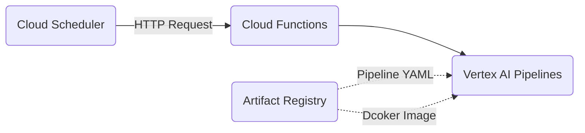

# Vertex AI Template

[](LICENSE)
[](https://github.com/psf/black)
[](https://www.python.org)

A template for typical machine learning projects using Vertex AI.

## Architecture



## Requirements

* Poetry
* Google Cloud SDK
* Terraform

## Installation

```shell
poetry install
```

```shell
poetry shell
```

## Deployment

### Terraform

Create Google Cloud Platform resources with Terraform:

```shell
inv terraform.init
```

```shell
inv terraform.apply
```

### Docker

Build Docker images for Vertex AI Pipelines components:

```shell
inv docker.build -f invoke-dev.yaml
```

Push Docker images:

```shell
inv docker.push -f invoke-dev.yaml
```

### Pipeline

Generate pipeline YAML with Kubeflow Pipelines SDK:

```shell
inv pipeline.build -f invoke-dev.yaml
```

Upload pipeline YAML to Google Cloud Artifact Registry:

```shell
inv pipeline.push -f invoke-dev.yaml
```
